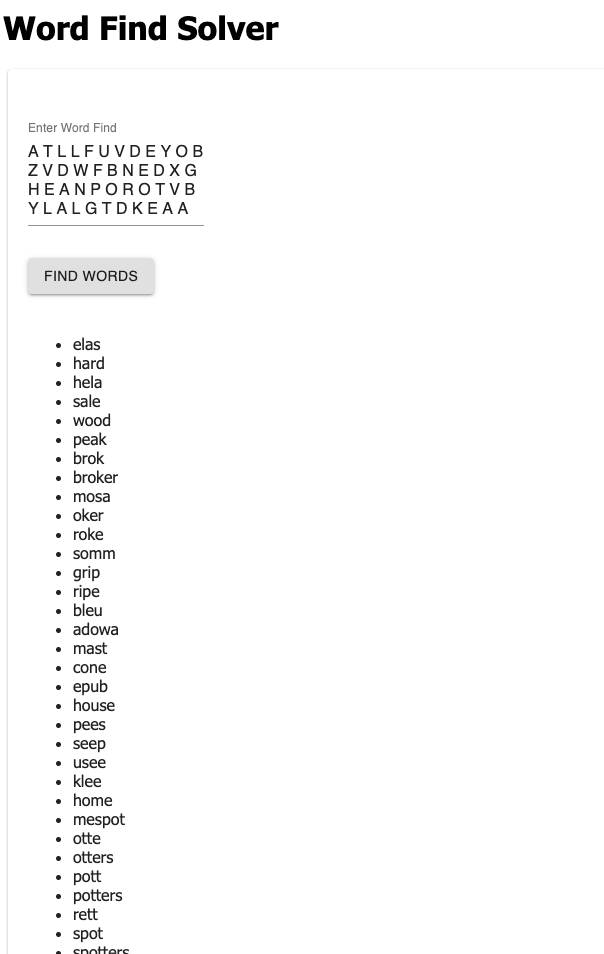

# Word Find Solver

This Word Find Solver will take in a Word Find and pick out words that are at least four letters in length.  Words may go up, down, left, or right.  

## Built With

This version uses React, Redux, Express, Passport, and PostgreSQL.  
A full list of dependencies can be found in `package.json`.

## Getting Started

### Prerequisites

Before you get started, make sure you have the following software installed on your computer:

- [Node.js](https://nodejs.org/en/)
- [PostrgeSQL](https://www.postgresql.org/)
- [Nodemon](https://nodemon.io/)

### Installation Instructions

* Run `npm install`
* Start postgres if not running already by using `brew services start postgresql`
* Run `npm run server`
* Run `npm run client`
* Navigate to `localhost:3000`

### Screen Shot

## Completed Requirements
* Will find all 4 letter or longer words
* Will find words in any direction: up, down, left, or right (not diagonal)
* Will handle arbitrarily sized puzzle inputs
* The solution does print out the list of found words
* The solution removes words that are subsets (Won't return "broke" and "broker": only "broker")

### Bugs To Fix
* Duplicate words print to DOM

### Next Steps
* Remove Console Logs
* Clean up layout
    * Display solution in more than one column to prevent user needing to scroll
* Design
    * Color Buttons
    * Add color to Page
    * Different color header (possibly add an app bar)
* Display user submitted puzzle
    * When user submits a word find, have the word find display on the DOM
    * Highlight words in wordfind when user hovers over the word in the found words list
* Ways to increase efficiency
    * ~~Remove short words on server side~~
    * DRY (Don't Repeat Yourself)
        * Consolidate repeated code
        * Combine functions into one where it makes sense to do so